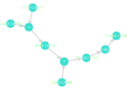

# Micrograd.jl(WIP)

A Julia implementation of Andrej's [micrograd](https://github.com/karpathy/micrograd) python package.

## Example 
### use of simple autograd engine
#### draw 
```Julia
using Micrograds
defaultVal = Value{Float64}
a = defaultVal(data = 2.0,label = "a")
b = defaultVal(data = 1., label = "b")
c = a + b; c.label = "c"
e = defaultVal(data = 4., label = "e")
d = c * e; d.label = "d"
f = relu(d)
drawgraph(f)
```


```Julia
backward(f)
drawgraph(f)
```


### use simple `nn` engine to train batched data
todo
