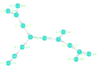

# Micrograd.jl

A Julia implementation of Andrej's [micrograd](https://github.com/karpathy/micrograd) python package.

should be fully functional right now, waiting for further integration with `Graph.jl` and pruning the code. 

## Example 
### use of simple autograd engine


```Julia
using Micrograds
defaultVal = Value{Float64}
a = defaultVal(data = 2.0,label = "a")
b = defaultVal(data = 1., label = "b")
c = a + b; c.label = "c"
e = defaultVal(data = 4., label = "e")
d = c * e; d.label = "d"
f = relu(d)
drawgraph(f)
```


```Julia
backward(f)
drawgraph(f)
```


### basic use of simple `nn` engine 
#### `draw_graph` with Neuron
```Julia
julia> n = Neuron(2)
relu Neuron(2)

julia> x = [1., -2.]
2-element Vector{Float64}:
  1.0
 -2.0

julia> y = n(x)
Value(,data=0.6758447934023317)

drawgraph(y)
```



#### `MLP` class and `zero_grad` function
```Julia
julia> model = MLP(2, [16, 16, 1])
MLP of [Layer of [relu Neuron(2), relu Neuron(2), relu Neuron(2), relu Neuron(2), relu Neuron(2), relu Neuron(2), relu Neuron(2), relu Neuron(2), relu Neuron(2), relu Neuron(2), relu Neuron(2), relu Neuron(2), relu Neuron(2), relu Neuron(2), relu Neuron(2), relu Neuron(2)], Layer of [relu Neuron(16), relu Neuron(16), relu Neuron(16), relu Neuron(16), relu Neuron(16), relu Neuron(16), relu Neuron(16), relu Neuron(16), relu Neuron(16), relu Neuron(16), relu Neuron(16), relu Neuron(16), relu Neuron(16), relu Neuron(16), relu Neuron(16), relu Neuron(16)], Layer of [Linear Neuron(16)]]

julia> parameters(model)
337-element Vector{defaultVal}:
 Value(,data=0.5122986272799579)
 Value(,data=0.6781612733121447)
 Value(,data=0.11625663289119348)
 Value(,data=0.887231745763768)
 Value(,data=0.8954375060553358)
 Value(,data=0.9228937920964062)
 ⋮
 Value(,data=0.3878971821596451)
 Value(,data=0.6597339179360313)
 Value(,data=0.17120071350754384)
 Value(,data=0.04221921543377716)
 Value(,data=0.46509360358631824)

julia> zero_grad(model)
337-element Vector{Float64}:
 0.0
 0.0
 0.0
 0.0
 0.0
 0.0
 ⋮
 0.0
 0.0
 0.0
 0.0
 0.0
 ```


## Use of `nn` engine to train batched model
should show up in the `nn_demo.jl` file(todo)